# Enfoque arquitectónico: Clean Architecture

| Elemento | Descripción aplicada a Raíz Andina |
|---|---|
| Patrón / enfoque arquitectónico | Clean Architecture (Arquitectura Limpia). |
| Objetivo | Separar las reglas del negocio de los detalles tecnológicos y controlar que las dependencias apunten siempre hacia el dominio. |
| ¿Qué problema resuelve? | Evita que las reglas de pedidos, pagos o menú queden atadas a Flask, SQLAlchemy, Mercado Pago o Cloudinary — cambiar de proveedor o de framework afecta solo su adaptador, no el resto del sistema (DA07). |
| Capas definidas | Dominio, Aplicación (casos de uso), Adaptadores de interfaz, Infraestructura (Frameworks & Drivers). |
| Beneficios | Facilita el mantenimiento y las pruebas; permite cambiar implementaciones técnicas (como ya pasó con Culqi → Mercado Pago) sin modificar las reglas del negocio; mejora la separación de responsabilidades. |

## Mapeo de capas sobre la estructura real del backend

| Capa (Clean Architecture) | Qué contiene | Equivalente actual en Raíz Andina |
|---|---|---|
| Entities (Dominio) | Reglas de negocio fundamentales | Modelos: `Producto`, `Pedido`, `Pago`, `Usuario`, `Sede`, `Categoria` (reglas como disponibilidad del producto o congelar el precio al pedir) |
| Use Cases (Aplicación) | Reglas específicas de cada operación | Los `*_service.py`: `pedido_service`, `pago_service`, `carta_service`, `cocina_service`, `auditoria_service` |
| Interface Adapters | Traducen entre el exterior y el dominio | Los `*_routes.py` (Blueprints Flask) y `sockets.py` (eventos Socket.IO) |
| Frameworks & Drivers (Infraestructura) | Detalles técnicos externos | Flask, SQLAlchemy/MySQL, Redis, `app/integrations/mercadopago.py`, `cloudinary_service.py`, `mailer.py` |

**Nota:** hoy el backend no separa estas capas en carpetas `dominio/aplicacion/infraestructura` como el proyecto Angular de referencia de la guía — los modelos SQLAlchemy combinan la entidad con el detalle de persistencia (ORM). Esta tabla documenta el mapeo conceptual de responsabilidades para esta guía, no implica una reestructuración del código real.

## Diagrama de capas

```mermaid
flowchart TD

    subgraph INFRA["INFRAESTRUCTURA — Frameworks & Drivers"]
        Flask["Flask + SQLAlchemy"]
        MySQL["MySQL 8.0"]
        RedisInfra["Redis"]
        MP["mercadopago.py"]
        Cloud["cloudinary_service.py"]
        Mail["mailer.py"]
    end

    subgraph ADAPT["ADAPTADORES DE INTERFAZ"]
        Routes["*_routes.py — Blueprints"]
        Sockets["sockets.py"]
    end

    subgraph APP["APLICACIÓN — Casos de uso"]
        PedidoSvc["pedido_service"]
        PagoSvc["pago_service"]
        CartaSvc["carta_service"]
        CocinaSvc["cocina_service"]
        AuditSvc["auditoria_service"]
    end

    subgraph DOM["DOMINIO — Entidades"]
        Producto["Producto"]
        Pedido["Pedido"]
        Pago["Pago"]
        Usuario["Usuario"]
        Sede["Sede"]
    end

    INFRA --> ADAPT
    ADAPT --> APP
    APP --> DOM

    style INFRA fill:#222,stroke:#fff,stroke-width:2px,color:#fff
    style ADAPT fill:#222,stroke:#fff,stroke-width:2px,color:#fff
    style APP fill:#222,stroke:#fff,stroke-width:2px,color:#fff
    style DOM fill:#222,stroke:#fff,stroke-width:2px,color:#fff

    style Flask fill:#222,stroke:#fff,color:#fff
    style MySQL fill:#222,stroke:#fff,color:#fff
    style RedisInfra fill:#222,stroke:#fff,color:#fff
    style MP fill:#222,stroke:#fff,color:#fff
    style Cloud fill:#222,stroke:#fff,color:#fff
    style Mail fill:#222,stroke:#fff,color:#fff

    style Routes fill:#222,stroke:#fff,color:#fff
    style Sockets fill:#222,stroke:#fff,color:#fff

    style PedidoSvc fill:#222,stroke:#fff,color:#fff
    style PagoSvc fill:#222,stroke:#fff,color:#fff
    style CartaSvc fill:#222,stroke:#fff,color:#fff
    style CocinaSvc fill:#222,stroke:#fff,color:#fff
    style AuditSvc fill:#222,stroke:#fff,color:#fff

    style Producto fill:#222,stroke:#fff,color:#fff
    style Pedido fill:#222,stroke:#fff,color:#fff
    style Pago fill:#222,stroke:#fff,color:#fff
    style Usuario fill:#222,stroke:#fff,color:#fff
    style Sede fill:#222,stroke:#fff,color:#fff
```

**Regla de dependencia:** las flechas van de afuera hacia adentro — Infraestructura depende de los Adaptadores, los Adaptadores invocan la Aplicación, y la Aplicación usa el Dominio. El Dominio no conoce ni depende de Flask, SQLAlchemy, Mercado Pago ni Cloudinary.