# Estilo arquitectónico

**Estilo seleccionado:** Monolito modular, con arquitectura en capas y comunicación cliente-servidor.

## Diagrama de arquitectura

```mermaid
flowchart TD

    %% =========================
    %% ACTORES
    %% =========================
    subgraph ACTORES["ACTORES"]
        Cliente["Cliente"]
        Cocina["Personal de Cocina"]
        AdminSede["Administrador de Sede"]
        SuperAdmin["Súper Administrador"]
    end

    %% =========================
    %% PRESENTACIÓN
    %% =========================
    subgraph PRESENTACION["PRESENTACIÓN"]
        SPA["SPA React (3 experiencias por rol) → API REST + Socket.IO"]
    end

    %% =========================
    %% LÓGICA DE NEGOCIO
    %% =========================
    subgraph NEGOCIO["LÓGICA DE NEGOCIO — monolito modular"]
        Auth["Autenticación y Seguridad"]
        Menu["Menú Digital"]
        Pedidos["Pedidos"]
        Pagos["Pagos"]
        KDS["Panel de Cocina (KDS)"]
        Reservas["Reservas de Mesas"]
        Fidelizacion["Fidelización"]
        Inventario["Inventario"]
        Admin["Administración Multisede"]
    end

    %% =========================
    %% CAPA TRANSVERSAL
    %% =========================
    subgraph TRANSVERSAL["CAPA TRANSVERSAL"]
        Redis["Redis: caché, cola de pedidos, eventos en tiempo real, límite de peticiones"]
    end

    %% =========================
    %% DATOS
    %% =========================
    subgraph DATOS["DATOS"]
        BD["MySQL 8.0"]
    end

    %% =========================
    %% SISTEMAS EXTERNOS
    %% =========================
    subgraph EXTERNOS["SISTEMAS EXTERNOS"]
        MercadoPago["Mercado Pago (pasarela de pago)"]
        Cloudinary["Cloudinary (imágenes)"]
        Correo["Servicio de correo"]
        Sentry["Sentry (monitoreo de errores)"]
    end

    %% =========================
    %% FLUJO PRINCIPAL
    %% =========================
    ACTORES --> PRESENTACION
    PRESENTACION -- HTTPS / JSON --> NEGOCIO
    PRESENTACION -- WebSocket --> TRANSVERSAL
    NEGOCIO --> DATOS
    NEGOCIO <--> TRANSVERSAL

    %% Integraciones
    NEGOCIO -->|"integraciones"| EXTERNOS

    %% =========================
    %% DISTRIBUCIÓN HORIZONTAL
    %% =========================
    Cliente ~~~ Cocina
    Cocina ~~~ AdminSede
    AdminSede ~~~ SuperAdmin

    Auth ~~~ Menu
    Menu ~~~ Pedidos
    Pedidos ~~~ Pagos
    Pagos ~~~ KDS
    KDS ~~~ Reservas
    Reservas ~~~ Fidelizacion
    Fidelizacion ~~~ Inventario
    Inventario ~~~ Admin

    MercadoPago ~~~ Cloudinary
    Cloudinary ~~~ Correo
    Correo ~~~ Sentry

    %% =========================
    %% ESTILOS
    %% =========================
    style ACTORES fill:#222,stroke:#fff,stroke-width:2px,color:#fff
    style PRESENTACION fill:#222,stroke:#fff,stroke-width:2px,color:#fff
    style NEGOCIO fill:#222,stroke:#fff,stroke-width:2px,color:#fff
    style TRANSVERSAL fill:#222,stroke:#fff,stroke-width:2px,color:#fff
    style DATOS fill:#222,stroke:#fff,stroke-width:2px,color:#fff
    style EXTERNOS fill:#222,stroke:#fff,stroke-width:2px,color:#fff

    style Cliente fill:#222,stroke:#fff,color:#fff
    style Cocina fill:#222,stroke:#fff,color:#fff
    style AdminSede fill:#222,stroke:#fff,color:#fff
    style SuperAdmin fill:#222,stroke:#fff,color:#fff

    style SPA fill:#222,stroke:#fff,color:#fff

    style Auth fill:#222,stroke:#fff,color:#fff
    style Menu fill:#222,stroke:#fff,color:#fff
    style Pedidos fill:#222,stroke:#fff,color:#fff
    style Pagos fill:#222,stroke:#fff,color:#fff
    style KDS fill:#222,stroke:#fff,color:#fff
    style Reservas fill:#222,stroke:#fff,color:#fff
    style Fidelizacion fill:#222,stroke:#fff,color:#fff
    style Inventario fill:#222,stroke:#fff,color:#fff
    style Admin fill:#222,stroke:#fff,color:#fff

    style Redis fill:#222,stroke:#fff,color:#fff

    style BD fill:#222,stroke:#fff,color:#fff

    style MercadoPago fill:#222,stroke:#fff,color:#fff
    style Cloudinary fill:#222,stroke:#fff,color:#fff
    style Correo fill:#222,stroke:#fff,color:#fff
    style Sentry fill:#222,stroke:#fff,color:#fff
```

## Descripción

La arquitectura de Raíz Andina se organiza como un **monolito modular en capas**, con arquitectura cliente-servidor:

- **Presentación:** una sola aplicación React (SPA) con tres experiencias distintas según el rol (cliente, administrador/súper administrador, cocina), que consume la API REST y el canal Socket.IO del backend.
- **Lógica de negocio:** un solo backend Flask dividido internamente en módulos independientes con fronteras claras: Autenticación y Seguridad (transversal), Menú Digital, Pedidos, Pagos, Panel de Cocina (KDS), Reservas de Mesas, Fidelización, Inventario y Administración Multisede.
- **Capa transversal (Redis):** absorbe los picos de tráfico mediante caché de la carta, cola de pedidos por sede, canal de eventos en tiempo real (Socket.IO) y límite de peticiones (rate limiting).
- **Datos:** toda la información persiste en una sola base de datos MySQL, que es la fuente de verdad del sistema.
- **Sistemas externos:** el módulo de Pagos se integra con Mercado Pago (pasarela de pago), el módulo de Menú se integra con Cloudinary (imágenes), y el sistema completo se apoya en un servicio de correo (recuperación de contraseña, comprobantes) y en Sentry (monitoreo de errores en producción).

Se eligió un monolito modular (en vez de microservicios) porque el proyecto es individual, con un plazo de 4 meses, y porque operaciones como "pedido + pago + descuento de stock" se resuelven mejor como una sola transacción de base de datos. Cada módulo ya tiene una frontera clara, de modo que en el futuro podría extraerse como servicio independiente si el crecimiento del negocio lo justificara.